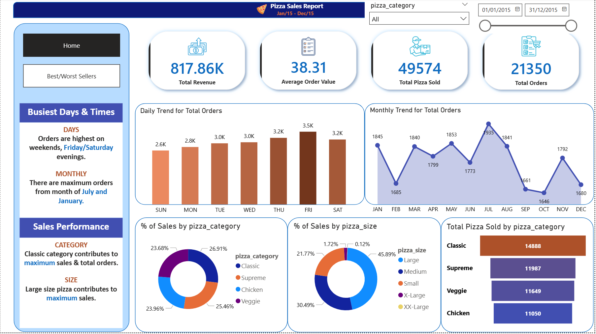
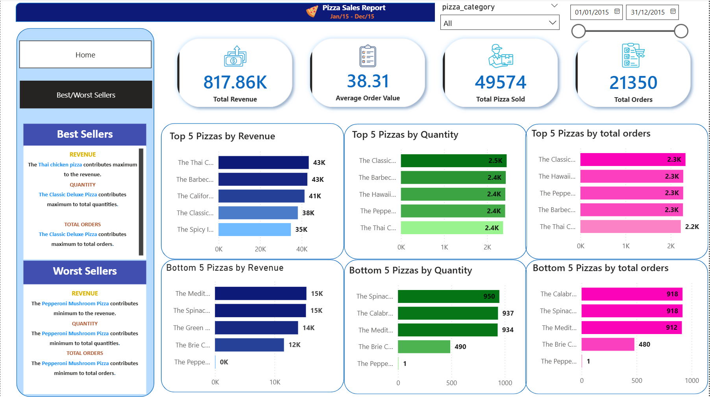

# 🍕 Pizza Sales Analysis — SQL + Power BI

## Overview
An end-to-end data analysis project that explores pizza sales data using SQL for data querying and Power BI for interactive visualizations.

## Objectives
- Analyze pizza sales trends and performance
- Identify best and worst selling pizzas
- Understand customer ordering patterns
- Track revenue and order metrics over time

## Tools Used
- **SQL** — Data extraction, cleaning, and analysis
- **Power BI** — Interactive dashboard and visualizations

## 🗂️ Dataset Structure

### Customers Table
- pizza_id
- pizza_id
- order_id
- pizza_name_id
- quantity
- order_date
- order_time
- unit_price
- total_price
- pizza_size
- pizza_category
- pizza_ingredients
- pizza_name

## Key Insights
- Total revenue, orders, and average order value
- Best performing pizza categories and sizes
- Peak sales periods (daily/monthly trends)
- Top and bottom selling pizzas by revenue and quantity

## Project Structure
├── data/               # Raw dataset
├── sql_queries/        # All SQL queries used
├── dashboard/          # Power BI (.pbix) file
└── README.md

## Dashboard Preview 1

## Dashboard Preview 2

## How to Use
1. Run the SQL queries in your preferred SQL environment
2. Open the `.pbix` file in Power BI Desktop
3. Explore the interactive dashboard
   
